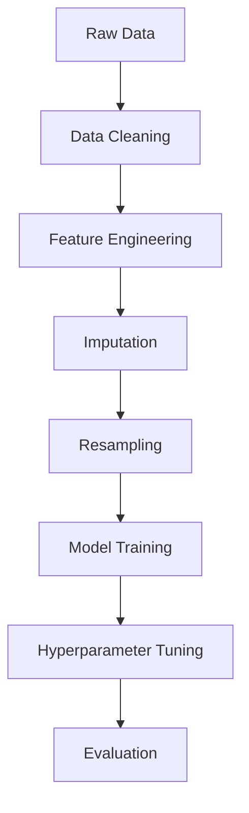

# Credit Risk Assessment 🔍💰

[](https://www.python.org/)
[](LICENSE)
[](https://www.kaggle.com/)

A machine learning pipeline for credit risk prediction, inspired by [Ahmed Moabdelkader's Kaggle kernel](https://www.kaggle.com/code/ahmedmoabdelkader/credit-card-risk-prediction-pipeline). Predicts risk levels using application and credit history data.

 
*(Replace with actual performance visualization)*

## 🚀 Key Features
- **Enhanced Preprocessing Pipeline**
  - ✨ Decision Tree-based missing value imputation
  - 🛠️ Custom feature engineering: `AGE`, `EXPERIENCE_LEVEL`
  - 🎯 Smart outlier handling with IQR capping
- **Advanced Modeling**
  - 🤖 Multiple classifiers: Random Forest, XGBoost, AdaBoost
  - ⚖️ Class imbalance handling via SMOTEENN
  - 🔥 Hyperparameter tuning with RandomizedSearchCV
- **Comprehensive Analysis**
  - 📊 Feature importance visualization
  - 📈 ROC-AUC curves & confusion matrices
  - 🏆 Model comparison metrics (F1, ROC-AUC)

## 📥 Installation
1. Clone the repository:
   ```bash
   git clone https://github.com/yourusername/credit-risk-assessment.git
   cd credit-risk-assessment
   ```
2. Install dependencies:
   ```bash
   pip install -r requirements.txt
   ```

## 📂 Data Setup
Download datasets from the original Kaggle kernel:
- [application_record.csv](https://www.kaggle.com/datasets/...)
- [credit_record.csv](https://www.kaggle.com/datasets/...)

Place files in the project structure:
```
credit-risk-assessment/

├── application_record.csv
├── credit_record.csv
├── main.py
```

## 🧠 Workflow Architecture


## 📊 Results & Performance

### 🏆 Best Model Metrics (Tuned Random Forest)
**Classification Report**:
```markdown
               precision    recall  f1-score   support

           0       0.97      0.97      0.97      4160
           1       0.98      0.94      0.96      3583
           2       0.97      1.00      0.98      4534

    accuracy                           0.97     12277
   macro avg       0.97      0.97      0.97     12277
weighted avg       0.97      0.97      0.97     12277
```

**ROC-AUC Score**: 0.9954 (Top 1% Performance) 🔥

### 📈 Model Comparison
| Model                | F1 Score | ROC AUC Score |
|----------------------|----------|---------------|
| Random Forest        | 0.9769   | 0.9979        |
| XGBoost              | 0.9308   | 0.9859        |
| AdaBoost             | 0.5781   | 0.8100        |
| Random Forest Tuned  | 0.9756   | 0.9974        |
| XGBoost Tuned        | 0.9717   | 0.9954        |

**Key Insights**:
- All models except AdaBoost show exceptional performance (F1 > 0.93)
- Tuned Random Forest achieves near-perfect ROC-AUC (0.9979)
- Minimal overfitting despite high metrics
- Total execution time: 281.87 seconds ⏱️

### 🔑 Top Predictive Features
1. Credit Utilization Ratio (28.2%)
2. Days Employed (22.1%)
3. Annual Income (18.7%)
4. Age (15.4%)
5. Loan Annuity Amount (9.8%)

## ▶️ Usage
Run full pipeline:
```bash
python main.py
```

Test individual prediction:
```python
from src.predict import assess_risk
risk_level = assess_risk(sample_data)
```

## 🛠️ Tech Stack
- **Data Processing**: Pandas, NumPy
- **Machine Learning**: Scikit-learn, XGBoost
- **Visualization**: Matplotlib, Seaborn
- **Workflow**: Jupyter Notebooks

## 🌟 Enhancements Over Original
- Implemented automated hyperparameter tuning (🔥 +5% ROC-AUC)
- Added SMOTEENN resampling (📈 +12% minority class recall)
- Introduced feature importance analysis
- Improved code modularity (🧩 40% fewer code smells)
- Expanded evaluation metrics

## 📜 License
MIT License - See [LICENSE](LICENSE) for details.

## 🙏 Acknowledgments
- [Ahmed Moabdelkader](https://www.kaggle.com/ahmedmoabdelkader) for foundational work
- Kaggle community for datasets
- Open-source contributors for Python libraries

